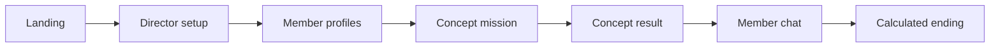

<p align="center">
  
</p>

<h1 align="center">Directing: Dopamine Diva</h1>

<p align="center">
  Idol comeback direction MVP with styling choices, relationship simulation, and optional Gemini-powered dialogue.
</p>

<p align="center">
  
  
  
  
</p>

## Overview

Directing: Dopamine Diva lets the player act as a comeback director. The player selects a concept, reviews the members, makes styling decisions, chats with a member, and reaches an ending based on relationship stats.

Gemini can generate dialogue and ending copy. When no API key is configured, the app falls back to deterministic local copy so the complete flow remains playable.

## Demo Flow



## Highlights

| Area | Implementation |
| --- | --- |
| Concept direction | `Dark Dopamine`, `Runway Crush`, and `Soft Savior` concepts |
| Relationship stats | Popularity, affection, jealousy, and mental state changes |
| AI dialogue | Gemini JSON response parser with fallback dialogue |
| Endings | Stat-driven happy, normal, and bad ending branches |
| Asset system | Posters, character portraits, outfits, and stage backgrounds under `public/` |

## Screens and Assets

| Main poster | Runway concept | Soft concept |
| --- | --- | --- |
|  |  |  |

More details are documented in `docs/assets.md` and `docs/project-structure.md`.

## Tech Stack

- Next.js App Router
- React 19 and TypeScript
- Tailwind CSS 4
- `@google/generative-ai`
- Browser `localStorage`
- Vercel Speed Insights

## Getting Started

```bash
npm install
cp .env.example .env.local
npm run dev
```

Open `http://localhost:3000`.

To enable Gemini responses:

```env
GEMINI_API_KEY=your_key_here
```

## Scripts

```bash
npm run dev        # Start the development server
npm run build      # Build for production
npm run start      # Run the production build
npm run lint       # ESLint
npm run typecheck  # TypeScript check
```

## Repository Layout

```text
.
├── app/                       # App Router pages
├── components/                # Reusable UI components
├── data/                      # Concepts, members, endings, missions
├── lib/                       # Game state, prompt building, ending logic
├── public/                    # Posters, characters, outfits, backgrounds
└── docs/                      # Asset and structure notes
```
