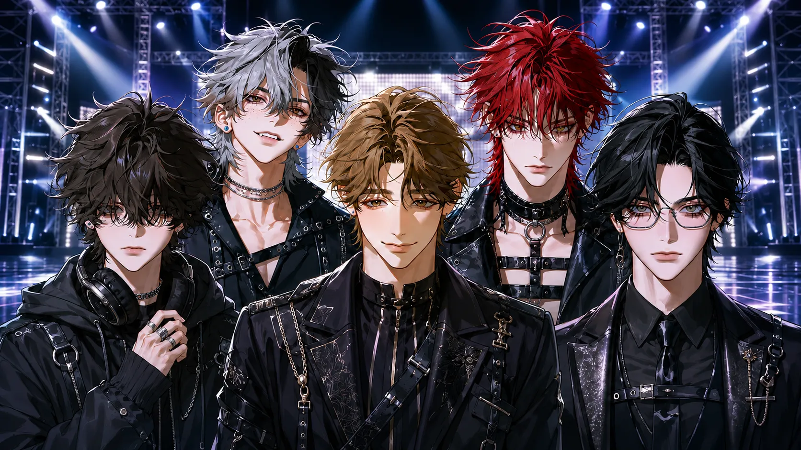
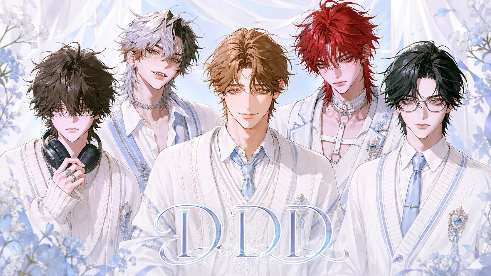
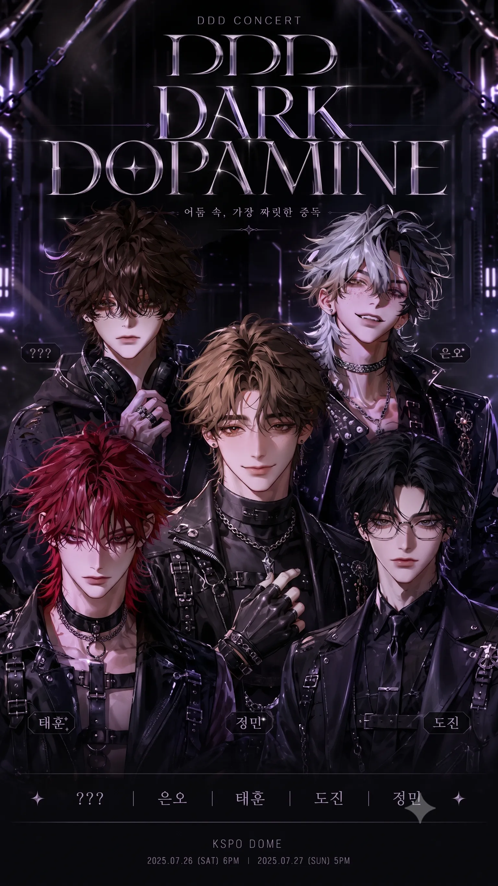
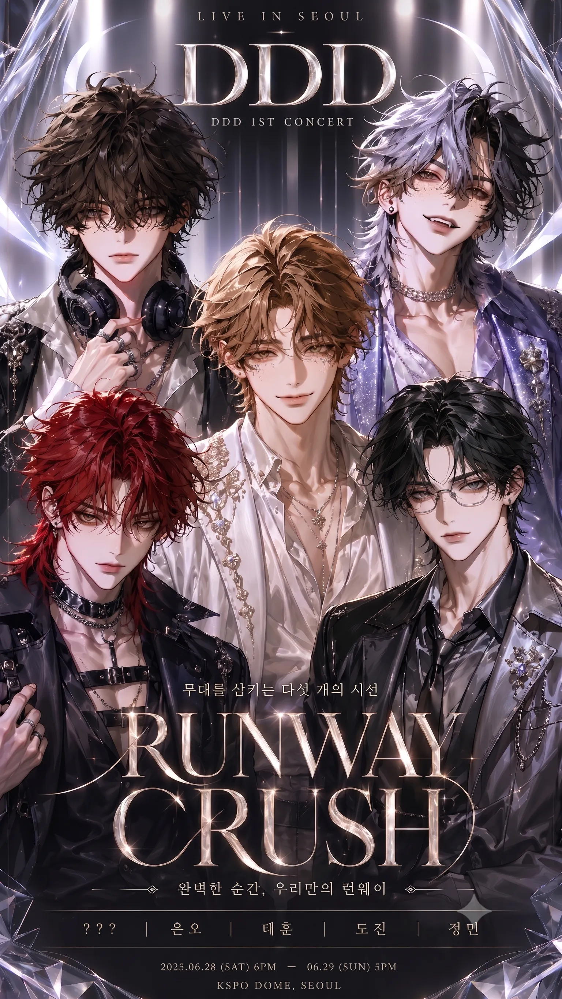
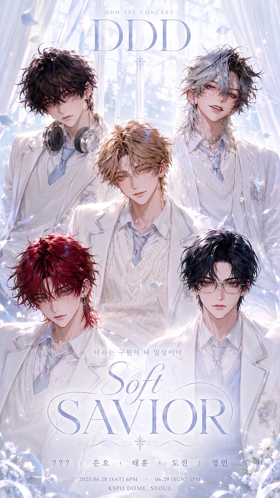

<p align="center">
  
</p>

<h1 align="center">Directing: Dopamine Diva</h1>

<p align="center">
  AI 스타일링 디렉팅과 관계성 시뮬레이션을 결합한 아이돌 컴백 MVP
</p>

<p align="center">
  
  
  
  
</p>

## Overview

**Directing: Dopamine Diva**는 사용자가 아이돌 그룹의 컴백 디렉터가 되어 콘셉트를 고르고, 멤버와 대화하며, 감정 지표에 따라 엔딩을 확인하는 인터랙티브 MVP입니다.

스타일링 선택은 단순한 스킨 변경이 아니라 멤버의 인기, 애정, 질투, 멘탈과 연결됩니다. Gemini API가 있으면 대화와 엔딩 문구를 동적으로 생성하고, 키가 없어도 폴백 대사로 전체 플로우를 체험할 수 있습니다.

## Highlights

| Area | Description |
| --- | --- |
| Concept Direction | `Dark Dopamine`, `Runway Crush`, `Soft Savior` 중 하나를 선택해 컴백 콘셉트를 결정합니다. |
| Relationship Simulation | 콘셉트와 대화가 멤버 A의 감정 지표를 바꾸고 엔딩 조건에 영향을 줍니다. |
| AI Conversation | Gemini 기반 JSON 응답으로 대사, 감정, 스탯 변화, 엔딩 힌트를 생성합니다. |
| Multi Ending | 대화 횟수와 최종 스탯에 따라 해피/배드/노멀 계열 엔딩을 생성합니다. |
| Asset-Driven UI | 포스터, 캐릭터, 의상 콘셉트, 스테이지 배경을 `public/` 아래에서 일관되게 관리합니다. |

## Demo Flow

1. `/`에서 알파 데모 랜딩을 확인합니다.
2. `/director`에서 디렉터 이름과 첫 설정을 입력합니다.
3. `/members`에서 5인 멤버 프로필을 탐색합니다.
4. `/mission`에서 컴백 콘셉트를 선택합니다.
5. `/result`에서 콘셉트 반영 결과를 확인합니다.
6. `/chat`에서 멤버 A와 대화하고 감정 지표를 변화시킵니다.
7. `/ending`에서 최종 엔딩을 확인합니다.

제출/발표용 보조 화면은 `/submission`, `/submission/recommend`, `/submission/consult`, `/submission/board`에 분리되어 있습니다.

## Tech Stack

- **Framework**: Next.js App Router
- **Language**: TypeScript
- **UI**: React, Tailwind CSS, class-variance-authority, lucide-react
- **AI**: `@google/generative-ai`
- **Persistence**: Browser `localStorage`
- **Analytics**: Vercel Speed Insights

## Getting Started

```bash
npm install
cp .env.example .env.local
npm run dev
```

로컬 서버가 열리면 `http://localhost:3000`에서 확인합니다.

Gemini API를 사용하려면 `.env.local`에 값을 넣습니다.

```bash
GEMINI_API_KEY=your_api_key_here
```

API 키가 비어 있으면 앱은 안전하게 폴백 대사를 반환합니다.

## Scripts

```bash
npm run dev        # 개발 서버 실행
npm run build      # 프로덕션 빌드
npm run start      # 빌드 결과 실행
npm run lint       # ESLint 검사
npm run typecheck  # TypeScript 타입 검사
```

## Project Structure

```text
app/                 Next.js routes and API handlers
components/          Shared UI components
data/                Members, missions, concepts, endings, fallback dialogue
lib/                 Game state, stat updates, prompt builders, ending logic
public/              Runtime assets used by the app
docs/                Repository documentation
```

자세한 구조는 [docs/project-structure.md](./docs/project-structure.md), 자산 카탈로그는 [docs/assets.md](./docs/assets.md)를 참고하세요.

## Asset Preview

| Cover | Main Poster |
| --- | --- |
|  |  |

| Dark Dopamine | Runway Crush | Soft Savior |
| --- | --- | --- |
|  |  |  |

## Environment Notes

- `.env.local`은 Git에 포함하지 않습니다.
- `.vercel/`과 빌드 산출물은 `.gitignore`에 의해 제외됩니다.
- 공개 업로드 전 실제 API 키가 커밋되지 않았는지 `git status --short`와 `git check-ignore .env.local`로 확인하세요.

## Roadmap

- 멤버 B-E 개별 대화 루트 확장
- 엔딩 이미지 생성/선택 플로우 고도화
- 미션별 대화 로그 요약과 리플레이 기능
- `next/image` 전환을 통한 이미지 최적화

## License

아직 라이선스가 지정되지 않았습니다. 외부 공개 범위와 사용 조건을 정한 뒤 `LICENSE` 파일을 추가하세요.
