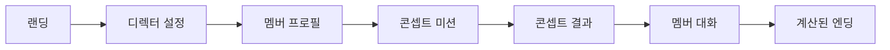

<p align="center">
  
</p>

<h1 align="center">Directing: Dopamine Diva</h1>

<p align="center">
  아이돌 컴백 디렉팅, 스타일 선택, 관계성 시뮬레이션, 선택적 Gemini 대화를 결합한 MVP입니다.
</p>

<p align="center">
  
  
  
  
</p>

## 개요

Directing: Dopamine Diva는 플레이어가 컴백 디렉터가 되어 콘셉트를 정하고, 멤버를 확인하고, 스타일링 결정을 내리고, 멤버와 대화한 뒤 관계 지표에 따라 엔딩을 확인하는 웹 MVP입니다.

Gemini가 설정되어 있으면 대화와 엔딩 문구를 동적으로 생성합니다. API 키가 없을 때도 로컬 폴백 문구로 전체 흐름을 플레이할 수 있습니다.

## 데모 흐름



## 주요 기능

| 영역 | 구현 내용 |
| --- | --- |
| 콘셉트 디렉팅 | `Dark Dopamine`, `Runway Crush`, `Soft Savior` 콘셉트 선택 |
| 관계 지표 | 인기, 애정, 질투, 멘탈 상태 변화 |
| AI 대화 | Gemini JSON 응답 파서와 폴백 대화 |
| 엔딩 | 스탯 기반 해피, 노멀, 배드 엔딩 분기 |
| 자산 관리 | 포스터, 캐릭터, 의상, 무대 배경을 `public/` 아래에서 관리 |

## 화면과 자산

| 메인 포스터 | Runway 콘셉트 | Soft 콘셉트 |
| --- | --- | --- |
|  |  |  |

자산과 구조에 대한 자세한 내용은 `docs/assets.md`, `docs/project-structure.md`에 정리되어 있습니다.

## 기술 스택

- Next.js App Router
- React 19, TypeScript
- Tailwind CSS 4
- `@google/generative-ai`
- 브라우저 `localStorage`
- Vercel Speed Insights

## 시작하기

```bash
npm install
cp .env.example .env.local
npm run dev
```

브라우저에서 `http://localhost:3000`을 엽니다.

Gemini 응답을 사용하려면 다음 환경 변수를 설정합니다.

```env
GEMINI_API_KEY=your_key_here
```

## 스크립트

```bash
npm run dev        # 개발 서버 실행
npm run build      # 프로덕션 빌드
npm run start      # 빌드 결과 실행
npm run lint       # ESLint
npm run typecheck  # TypeScript 검사
```

## 레포 구조

```text
.
├── app/                       # App Router 페이지
├── components/                # 재사용 UI 컴포넌트
├── data/                      # 콘셉트, 멤버, 엔딩, 미션 데이터
├── lib/                       # 게임 상태, 프롬프트, 엔딩 계산 로직
├── public/                    # 포스터, 캐릭터, 의상, 배경
└── docs/                      # 자산과 구조 문서
```
