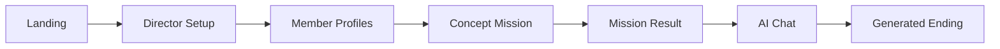
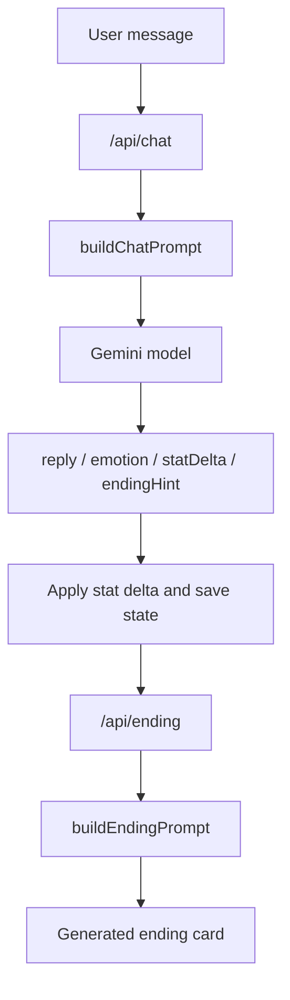

# Project Structure

이 저장소는 Next.js App Router 기반의 인터랙티브 MVP입니다. 코드, 데이터, 에셋이 각각 명확한 역할을 갖도록 분리되어 있습니다.

## Top-Level Layout

```text
.
├── app/
├── components/
├── data/
├── docs/
├── lib/
├── public/
├── eslint.config.mjs
├── next.config.ts
├── package.json
└── tsconfig.json
```

## Routes

| Route | Purpose |
| --- | --- |
| `/` | 알파 데모 랜딩과 재입장 진입점 |
| `/director` | 디렉터 설정 및 게임 초기화 |
| `/members` | 5인 멤버 프로필 탐색 |
| `/mission` | 컴백 콘셉트 선택 |
| `/result` | 콘셉트 선택 결과와 스탯 변화 확인 |
| `/chat` | 멤버 A와 AI 대화 |
| `/ending` | 최종 엔딩 생성/표시 |
| `/shop` | 추가 대화권 구매 흐름 |
| `/submission/*` | 제출/발표용 화면 모음 |
| `/api/chat` | Gemini 대화 응답 API |
| `/api/ending` | Gemini 엔딩 생성 API |

## Data Model

| File | Role |
| --- | --- |
| `data/members.ts` | 멤버 타입, 초기 스탯, 게임 상태 타입 |
| `data/missions.ts` | 콘셉트 미션과 스탯 변화량 |
| `data/concepts.ts` | 콘셉트별 시작 대사, 추천 질문, 페르소나 |
| `data/endings.ts` | 정적 엔딩 카드 메타데이터 |
| `data/doha.ts` | Gemini 실패 시 사용할 폴백 대사/엔딩 |

## Game Flow



## Runtime State

게임 상태는 브라우저 `localStorage`에 저장됩니다.

- 저장 키: `style-expression-mvp-state`
- 저장 위치: `lib/gameStorage.ts`
- 주요 값: 선택한 미션, 멤버별 스탯, 그룹 지표, 채팅 기록, 엔딩 ID, 추가 대화권 수

## AI Flow



API 키가 없거나 모델 응답 파싱에 실패하면 `data/doha.ts`의 폴백 응답을 반환합니다. 이 덕분에 데모 환경에서도 전체 사용자 플로우가 끊기지 않습니다.

## Shared UI Components

| Component | Purpose |
| --- | --- |
| `Button` | 주요/보조 액션 버튼 |
| `Badge` | 상태, 미션, 키워드 라벨 |
| `Modal` | 미션 상세, 멤버 상세, 구매 안내 |
| `MemberCard` | 멤버 프로필 카드 |
| `MissionCard` | 미션 카드 |
| `ChatBubble` | 유저/AI 채팅 메시지 |
| `StatBar` | 멤버 감정/지표 표시 |
| `EndingCard` | 최종 엔딩 카드 |
| `ResultPanel` | 선택 결과 요약 |

## Maintenance Notes

- 앱에서 참조하는 이미지는 `public/` 아래에만 둡니다.
- 새 미션을 추가할 때는 `data/missions.ts`, `data/concepts.ts`, 관련 포스터를 함께 업데이트합니다.
- 새 멤버 대화 루트를 추가할 때는 `data/members.ts`, 프롬프트 빌더, 채팅 화면의 `MEMBER_ID` 처리 방식을 함께 검토합니다.
- 공개 업로드 전 `.env.local`, `.vercel/`, `.next/`, `node_modules/`가 추적되지 않는지 확인합니다.
